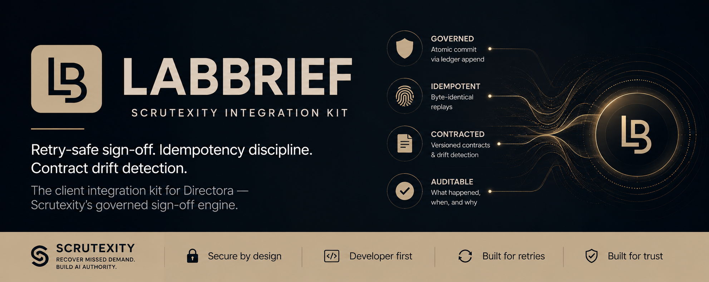

<!-- =======================
     LABBRIEF • README
     Scrutexity Integration Kit
     ======================= -->

<div align="center">
  
</div>

<div align="center">

[](LICENSE)
[](https://github.com/Scrutexity/LabBrief)
[](https://github.com/Scrutexity/Directora)

# LABBRIEF

**Client integration kit for Directora**  
*Retry-safe sign-off. Idempotency discipline. Contract drift detection.*

**This repo is NOT the full LabBrief product UI.**  
It is the **public integration surface** (schemas + client patterns) for the governed API.

</div>

---

## What this is

LabBrief is the client-side companion to **Directora** — Scrutexity’s governed sign-off engine.

This repo exists to make it easy for a client app to integrate with Directora while preserving the core guarantees:

- **Atomic commit** via ledger append
- **Byte-identical idempotent replays**
- **Contract versioning + drift detection**
- **Audit trail consumption** (verify what happened, when, and why)

> Governed workflows are only real if the client behaves correctly under retries, timeouts, and partial failures. This kit provides those rules.

## What this is not

- Not a “patient booking” product
- Not a chatbot
- Not a compliance certification tool
- Not the internal LabBrief UI

## Where the governed API lives

**Directora (server):** https://github.com/Scrutexity/Directora

---

## Quick Start

> Stand up Directora first. This kit assumes you have a Directora base URL and a way to mint auth tokens.

### Install

```bash
npm install
# or
pnpm install
# or
yarn
```

### Configure

Set your Directora URL + auth strategy (example):

```ts
export const DIRECTORA_BASE_URL =
  process.env.DIRECTORA_BASE_URL ?? "http://localhost:8000";
```

### Core flow (sign a brief safely)

A correct client must:

1. Generate a stable `Idempotency-Key`
2. Send `X-Contract-Version`
3. Retry only on retryable conditions (timeouts / 503 / 429)
4. Treat conflicts as non-retryable (409 / 422 / most 4xx)

---

## Integration surface (high-level)

Typical modules you’ll expose from this repo:

- `contract/` — contract version + schema snapshot checks
- `idempotency/` — idempotency key rules + replay awareness
- `retry/` — retry policy (bounded, jittered, never on conflict)
- `client/` — typed HTTP client wrapper for Directora endpoints
- `audit/` — audit trail fetch + optional verify calls

If you keep this repo minimal (recommended), focus on:
- request builders
- headers
- retry policy
- drift guard

---

## Directora endpoints this kit targets

```text
GET  /api/brief/pending
GET  /api/brief/provider
POST /api/brief/sign
GET  /api/labs/audit
GET  /health
```

---

## React Animation Component (optional)

If you want the animated governance-flow component, it lives in the Directora repo:

```text
Directora/components/ScrutexityFlow.tsx
```

It uses Framer Motion. In a React app:

```bash
npm install framer-motion
```

(Completely optional — not required for API integration.)

---

## Security & scope

This kit does not store PHI. It is a client library + patterns.

Directora does not claim HIPAA, SOC 2, FDA, legal, or regulatory certification. It provides governance mechanisms, auditability patterns, and safer workflow infrastructure.

---

<div align="center">

**SCRUTEXITY // 2026**

*Recover missed demand. Build AI authority.*

</div>
